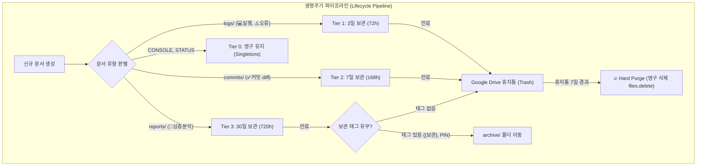

# Google Drive 저장소 구조, 네이밍 규칙 및 생명주기 관리 엔진 설계 사양서 (v2.1.z)
**문서 식별자:** `SPEC-DRIVE-LIFECYCLE-001`  
**작성자:** gem-bridge Drive Storage & Lifecycle Architect  
**대상 시스템:** `gem-bridge` (v2.1.x) / `daemon_v2.py` / Google Drive API v3  

---

## 1. 개요 및 배경 (Executive Summary)

### 1.1 배경 및 당면 과제
`gem-bridge`는 사용자가 모바일(스마트폰) 환경에서 Google Docs를 통해 WSL/로컬 개발 환경의 저장소를 조회, 수정, 실행하도록 중계하는 시스템입니다.
시스템 운영 기간이 길어짐에 따라 다음과 같은 저장소 관리 문제가 발생합니다:
1. **루트 폴더 오염 (Root Cluttering):** 생성된 보고서(`[보고서] ...`), 커밋 완료 문서(`[완료] ...`), 실행 결과(`[실행결과] ...`), 에러 보고서(`[오류] ...`)가 `GeminiBridge/` 단일 루트에 무분별하게 누적되어 핵심 제어 문서(`CONSOLE`, `STATUS`)를 모바일에서 찾기 어려워짐.
2. **모바일 가독성 저하 (Mobile Truncation):** 스마트폰 Google Docs 앱의 파일 목록은 20~28자 내외에서 파일명이 잘립니다. 타임스탬프나 불필요한 태그가 앞에 길게 붙을 경우 정작 어떤 리포지토리의 어떤 작업인지 파악하기 어렵습니다.
3. **Gemini AI 환각 및 검색 노이즈 (RAG Confusion):** Google Workspace와 연동된 Gemini AI(스마트폰 또는 웹)가 사용자의 오래된 로그, 실패한 에러 보고서, 임시 태스크 문서를 최신 정보로 오인 인용하는 문제 발생.
4. **수동 정리 부담:** 사용자가 주기적으로 Google Drive에 접속하여 파일을 일일이 선택하고 삭제하는 비효율성.

### 1.2 설계 목표
- **구조화 (Folder Hierarchy):** 목적 및 성격에 따른 엄격한 계층적 폴더 분리 및 핵심 문서의 루트 고정.
- **가독성 & 정렬 최적화 (Mobile-First Naming):** 모바일 화면 잘림 방지 + 직관적 시각 식별(Emoji Tag) + 역순 시간 정렬 지원.
- **수명주기 차등화 (Tiered Retention):** 영구/장기/단기/휘발성 데이터의 보존 기한 자동 적용.
- **완전 자동화 (Auto Janitor Engine):** 데몬의 백그라운드 주기적 청소 + CONSOLE 모바일 대화형 원격 트리거.

---

## 2. 계층적 폴더 트리 구조 (Folder Hierarchy)

### 2.1 폴더 트리 아키텍처 다이어그램
```text
My Drive (내 드라이브)
└── 📁 GeminiBridge/                           <-- [Root] 데몬이 탐색/관리하는 기본 루트
    ├── 📄 CONSOLE                             <-- [싱글톤] 대화형 모바일 제어 콘솔 (루트 고정)
    ├── 📄 STATUS                              <-- [싱글톤] 실시간 시스템 상태 및 헬스체크 (루트 고정)
    │
    ├── 📁 reports/                            <-- [Tier 3] 심층 코드 분석 및 브리핑 보고서
    │   ├── 📁 2026-09/                        <-- 연월별 서브폴더 (YYYY-MM 자동 롤링)
    │   └── 📁 2026-10/
    │
    ├── 📁 commits/                            <-- [Tier 2] Git 코드 변경 및 푸시 완료 증빙 diff
    │   └── 📁 2026-09/
    │
    ├── 📁 logs/                               <-- [Tier 1] CLI 명령어 실행 결과 및 오류 보고서
    │   ├── 📁 2026-09/
    │   └── 📁 errors/                         <-- 시스템 에러 트레이스백 집중 격리
    │
    └── 📁 archive/                            <-- [Tier 4] 영구 보존용 중요 보고서 및 스냅샷
        └── 📁 manual_pins/                    <-- 사용자가 보관 요청한 문서
```

### 2.2 폴더별 역할 및 격리 원칙

| 폴더명 | 용도 및 저장 대상 | 생성 주체 | 자동 생성 정책 |
| :--- | :--- | :--- | :--- |
| **`GeminiBridge/` (Root)** | `CONSOLE`, `STATUS` 단일 제어 문서 및 사용자 신규 태스크 인입 위치 | 데몬 부팅 시 확인 | 단일 루트 고정 |
| **`reports/`** | `executor_read.py`가 생성한 코드 분석 보고서 | Read Executor | `reports/YYYY-MM/` 형태로 월별 자동 롤링 |
| **`commits/`** | `write_executor.py`의 코드 반영 및 Git 커밋 diff 문서 | Daemon Dispatcher | `commits/YYYY-MM/` 형태로 월별 자동 롤링 |
| **`logs/`** | `exec_executor.py` CLI 실행 결과, stdout/stderr 덤프 | Exec Executor | `logs/YYYY-MM/` 형태로 보관 후 3일 내 삭제 |
| **`logs/errors/`** | 예외 발생 시 `_handle_task_error`가 남기는 트레이스백 문서 | Exception Handler | 오류 분석용 격리 |
| **`archive/`** | 사용자가 `[보관]` 태그를 붙였거나 보존 요청한 중요 산출물 | Janitor / 사용자 | 영구 보존 |

### 2.3 루트 고정 원칙 (Root Anchoring Rule)
- **대상:** `CONSOLE`, `STATUS`
- **원칙:** 
  1. `CONSOLE`과 `STATUS`는 어떠한 경우에도 하위 폴더(`reports/` 등)로 이동되거나 삭제되지 않습니다.
  2. 모바일 Google Docs/Drive 앱 첫 화면 진입 시 하위 폴더 진입(Drill-down) 없이 1-Tap으로 즉시 열 수 있어야 합니다.
  3. 데몬은 항상 `folder_id` 직하의 부모 ID만을 기준으로 두 문서의 유일성(Singleton)을 보장합니다.

---

## 3. 표준화된 네이밍 컨벤션 (Mobile-First Naming Convention)

### 3.1 모바일 화면 UI 제약 분석
- 스마트폰 Google Drive/Docs 앱 목록 뷰의 제목 표시 한계: **공백 포함 약 22~28자**.
- 제목 앞에 긴 타임스탬프(`20260912_173000_REPORT_...`)가 붙으면 모바일 화면에는 `20260912_173000_REP...`만 보여 문서 구분이 불가능해집니다.
- 반면, Drive 검색 엔진과 웹 브라우저에서는 시간순 정렬과 고유 식별자(Unique ID)가 필수적입니다.

### 3.2 네이밍 포맷 공식

$$\mathbf{[이모지+태스크유형]} \;\; \mathbf{저장소} \mathbf{:} \;\; \mathbf{핵심요약} \;\; \mathbf{(YYMMDD\_HHmm)}$$

```text
포맷 템플릿:
[{TYPE_ICON}{TYPE_TAG}] [{REPO_SHORT}] {ACTION_SUMMARY} ({DATE_SUFFIX})
```

#### 컴포넌트 세부 명세:
1. **타입 태그 (Type Tag, 4~6자):**
   - `[📄분석]`: 코드 읽기/분석/리포트 (`TaskType.READ`)
   - `[✅커밋]`: 코드 변경 및 Git 반영 (`TaskType.WRITE`)
   - `[💻실행]`: 터미널 쉘 명령어 실행 (`TaskType.EXEC`)
   - `[⚠️오류]`: 파이프라인 처리 실패 및 예외 (`ERROR`)
   - `[📌보관]`: 영구 아카이브 대상 (`ARCHIVE`)
2. **저장소 식별자 (Repo Tag, 3~8자):**
   - 대괄호 또는 콜론으로 구분: `[bridge]`, `[al-hub]`, `[core]`
3. **핵심 요약 (Core Summary, 10~18자):**
   - 핵심 동작/목적어를 앞으로 전진 배치 (예: `데몬 메모리 누수 분석`, `버전 2.1.5 범프`)
4. **타임스탬프 접미사 (Compact Date Suffix, 11자):**
   - 모바일에서 잘려도 큰 지장이 없는 끝부분에 배치: `(260912_1731)` (YYMMDD_HHmm)

### 3.3 실제 네이밍 적용 예시 비교

| 작업 유형 | 권장 파일명 (Mobile-First) | 모바일 목록 가독성 (앞 24자) |
| :--- | :--- | :--- |
| **코드 분석** | `[📄분석:bridge] 데몬 메모리 누수 점검 (260912_1730)` | `[📄분석:bridge] 데몬 메모리 누수...` (식별 완벽) |
| **Git 커밋** | `[✅커밋:bridge] hotfix retry 버그 수정 (260912_1735)` | `[✅커밋:bridge] hotfix retry...` (식별 완벽) |
| **CLI 실행** | `[💻실행:bridge] pytest 통합테스트 (260912_1740)` | `[💻실행:bridge] pytest 통합테...` (식별 완벽) |
| **예외 오류** | `[⚠️오류:bridge] GitPushError 인증실패 (260912_1742)` | `[⚠️오류:bridge] GitPushError...` (식별 완벽) |

---

## 4. 데이터 생명주기 및 자동 정리 정책 (Retention & Purge Policy)

### 4.1 계층별 보존 기한 (Tiered Retention Matrix)



| 티어 (Tier) | 대상 문서군 | 보존 기간 | 만료 시 처리 | 근거 |
| :--- | :--- | :---: | :---: | :--- |
| **Tier 0 (Singleton)** | `CONSOLE`, `STATUS` | **영구 (무제한)** | 덮어쓰기 갱신 | 시스템 인터페이스 핵심 |
| **Tier 1 (Volatile)** | `logs/` (명령어 실행 결과, 에러 보고서) | **3일 (72시간)** | 휴지통(Trash) 즉시 이동 | 휘발성 디버깅 정보, 신속한 정리 필요 |
| **Tier 2 (Transient)** | `commits/` (Git 커밋 반영 확인서) | **7일 (168시간)** | 휴지통(Trash) 즉시 이동 | GitHub 원격 저장소에 영구 보존되므로 7일 후 불필요 |
| **Tier 3 (Asset)** | `reports/` (Gemini 코드 분석 보고서) | **30일 (720시간)** | `archive/` 이동 또는 휴지통 | 30일 경과 후 가치 감소, 영구 가치 문서는 아카이브 |
| **Tier 4 (Permanent)**| `archive/` (수동 보관 요청 문서) | **영구 / 사용자 지정** | 보존 유지 | 명시적 보존 요청 |

### 4.2 휴지통(Trash) 격리 및 영구 삭제(Hard-Purge) 2단계 정책
1. **문제점 (RAG / AI Hallucination):**
   - 구글 드라이브의 휴지통(`trashed=true`)에 파일이 남아있더라도, 서드파티 인덱서나 특정 Gemini Workspace 확장 프로그램에서 검색 인덱스에 걸려 구버전 문서를 인용할 위험이 존재합니다.
2. **2단계 제거 프로세스:**
   - **1단계 (Soft-Delete):** `files.update(fileId=..., body={"trashed": True})`
     - 보관 주기 만료 시 즉시 휴지통으로 이동. 사용자 실수 복구 여지 제공.
   - **2단계 (Hard-Purge):** `files.delete(fileId=...)`
     - 휴지통에 들어간 지 7일 이상 지난 문서, 또는 사용자가 "휴지통 비워줘" 명령을 내렸을 때 영구 파기하여 드라이브 쿼터 절약 및 AI 색인 원천 차단.

---

## 5. 데몬(daemon_v2.py) 연동 및 아키텍처 설계

### 5.1 드라이브 스토리지 매니저 컴포넌트 (`DriveStorageManager`)
데몬 내부에 폴더 계층 탐색, 지연 생성(Lazy Creation), 캐싱, 파일 라우팅을 전담하는 모듈을 도입합니다.

```python
# core/drive_storage.py (설계 아키텍처)

import time
from typing import Dict, Optional
from googleapiclient.discovery import Resource
from core.logger import logger

class DriveStorageManager:
    """
    Google Drive의 GeminiBridge 하위 폴더 트리 관리, 캐싱 및 라우팅 전담 모듈.
    """
    def __init__(self, drive_service: Resource, root_folder_id: str):
        self.drive_service = drive_service
        self.root_folder_id = root_folder_id
        self._folder_cache: Dict[str, str] = {}  # 경로(예: 'reports/2026-09') -> folder_id

    def get_destination_folder(self, category: str, auto_monthly: bool = True) -> str:
        """
        문서 카테고리(reports, commits, logs, archive)에 따른 적절한 하위 폴더 ID를 반환.
        캐시에 없으면 드라이브에서 조회하거나 새로 생성한 뒤 캐싱.
        """
        if not self.drive_service or not self.root_folder_id:
            return self.root_folder_id

        # 연월 서브폴더 경로 계산 (예: reports/2026-09)
        current_month = time.strftime("%Y-%m")
        path_key = f"{category}/{current_month}" if auto_monthly else category

        if path_key in self._folder_cache:
            return self._folder_cache[path_key]

        # 1. 상위 카테고리 폴더 확보 (예: GeminiBridge/reports)
        parent_cat_id = self._find_or_create_subfolder(self.root_folder_id, category)

        # 2. 월별 하위 폴더 확보 (예: GeminiBridge/reports/2026-09)
        if auto_monthly:
            dest_folder_id = self._find_or_create_subfolder(parent_cat_id, current_month)
        else:
            dest_folder_id = parent_cat_id

        self._folder_cache[path_key] = dest_folder_id
        return dest_folder_id

    def _find_or_create_subfolder(self, parent_id: str, folder_name: str) -> str:
        q = f"mimeType = 'application/vnd.google-apps.folder' and name = '{folder_name}' and '{parent_id}' in parents and trashed = false"
        res = self.drive_service.files().list(q=q, fields="files(id, name)").execute()
        files = res.get("files", [])
        if files:
            return files[0]["id"]

        # 없으면 생성
        meta = {
            "name": folder_name,
            "mimeType": "application/vnd.google-apps.folder",
            "parents": [parent_id]
        }
        folder = self.drive_service.files().create(body=meta, fields="id").execute()
        logger.info(f"[DriveStorage] Created subfolder '{folder_name}' under parent {parent_id}: {folder['id']}")
        return folder["id"]
```

### 5.2 데몬 실행 엔진(Executors) 라우팅 연동
- **`ReadExecutor` (분석 보고서):**
  - 저장 위치: `storage_manager.get_destination_folder("reports")`
  - 파일명 포맷: `[📄분석:{repo}] {clean_title} ({YYMMDD_HHmm})`
- **`WriteExecutor` (커밋 완료 diff):**
  - 저장 위치: `storage_manager.get_destination_folder("commits")`
  - 파일명 포맷: `[✅커밋:{repo}] {commit_msg} ({YYMMDD_HHmm})`
- **`ExecExecutor` (CLI 결과):**
  - 저장 위치: `storage_manager.get_destination_folder("logs")`
  - 파일명 포맷: `[💻실행:{repo}] {command} ({YYMMDD_HHmm})`
- **`_handle_task_error` (오류 보고서):**
  - 저장 위치: `storage_manager.get_destination_folder("logs/errors", auto_monthly=False)`
  - 파일명 포맷: `[⚠️오류:{repo}] {doc_name} ({YYMMDD_HHmm})`

---

## 6. 백그라운드 자동 정리 엔진 (Janitor Loop) 및 원격 트리거

### 6.1 주기적 백그라운드 청소 엔진 (`StorageJanitor`)
데몬의 메인 이벤트 루프 또는 백그라운드 타이머에 의해 하루 1회(예: 매일 자정 또는 6시간 주기) 저부하 시간대에 자동 청소를 실행합니다.

```python
# core/janitor.py (설계 아키텍처)

import time
from datetime import datetime, timedelta
from core.logger import logger

class StorageJanitor:
    RETENTION_DAYS = {
        "logs": 3,
        "commits": 7,
        "reports": 30
    }

    def __init__(self, drive_service, root_folder_id, storage_manager):
        self.drive_service = drive_service
        self.root_folder_id = root_folder_id
        self.storage_manager = storage_manager
        self.last_run_timestamp = 0

    def run_cleanup_cycle(self, force: bool = False) -> dict:
        """
        보존 기한을 검사하여 오래된 문서를 휴지통으로 이동하고,
        휴지통에 7일 이상 방치된 문서를 영구 삭제(Purge)함.
        """
        now = time.time()
        # 6시간 간격 또는 강제 실행
        if not force and (now - self.last_run_timestamp < 6 * 3600):
            return {"status": "skipped"}

        logger.info("[Janitor] Starting automated drive storage cleanup cycle...")
        trashed_count = 0
        purged_count = 0

        # 1. 폴더별 보존 기한 검사 및 Soft-Delete
        for category, days in self.RETENTION_DAYS.items():
            threshold_date = (datetime.utcnow() - timedelta(days=days)).isoformat() + "Z"
            # 해당 카테고리 폴더 하위 탐색
            trashed_count += self._soft_delete_expired(category, threshold_date)

        # 2. 휴지통에서 7일 이상 지난 문서 영구 삭제 (Hard-Purge)
        purge_threshold = (datetime.utcnow() - timedelta(days=7)).isoformat() + "Z"
        purged_count += self._hard_purge_trash(purge_threshold)

        self.last_run_timestamp = now
        logger.info(f"[Janitor] Cleanup cycle completed: {trashed_count} trashed, {purged_count} purged.")
        return {
            "status": "success",
            "trashed_files": trashed_count,
            "purged_files": purged_count,
            "timestamp": time.strftime("%Y-%m-%d %H:%M:%S")
        }
```

### 6.2 모바일 원격 트리거 방안 (Mobile Remote Trigger via CONSOLE)
사용자가 스마트폰에서 Google Docs의 `CONSOLE` 문서를 열고 자연어 또는 단축 명령어로 즉시 스토리지를 청소하고 현황을 확인할 수 있습니다.

#### 지원 명령어 및 의도 매핑 (Intent Mapping)
1. **`clean logs` / `오래된 로그 정리해줘` / `정리`**
   - 3일 이상 경과한 로그 및 7일 이상 경과한 커밋 알림 문서를 즉시 휴지통으로 이동.
2. **`clean trash` / `휴지통 비워줘` / `완전 삭제`**
   - Google Drive 휴지통 내의 `GeminiBridge` 관련 폐기 파일 영구 삭제(`files.delete`).
3. **`storage status` / `용량 확인` / `드라이브 통계`**
   - 각 서브폴더별(`reports`, `commits`, `logs`) 파일 개수 및 최근 생성 파일 통계 브리핑.

#### CONSOLE 피드백 렌더링 예시
```markdown
### 🧹 [Google Drive 스토리지 정리 완료]
- 실행 시각: 2026-09-12 17:35:10 KST
- 만료 문서 정리 (Trash 이동):
  * `logs/` (3일 경과): 12개 파일
  * `commits/` (7일 경과): 5개 파일
- 영구 파기 (Hard Purge): 8개 파일 완전 삭제 완료
- 현재 활성 상태:
  * `reports/`: 14개 보관 중
  * `commits/`: 6개 보관 중
  * `logs/`: 2개 보관 중
*(루트의 CONSOLE 및 STATUS 문서는 안전하게 보호되었습니다.)*
```

---

## 7. 단계별 구축 로드맵 (Implementation Roadmap)

1. **1단계: `core/drive_storage.py` 신설**
   - 폴더 계층 관리, 캐싱, Mobile-first 네이밍 헬퍼 클래스 구현.
2. **2단계: 데몬 및 Executor 연동 (v2.1.z)**
   - `daemon_v2.py`, `executor_read.py`, `executor_exec.py`의 `parent_id` 지정 로직을 신규 스토리지 매니저로 교체.
   - 기존 파일명 생성 루틴을 `Mobile-First Naming` 규칙으로 표준화.
3. **3단계: `core/janitor.py` 엔진 및 CONSOLE 원격 명령어 연동**
   - 백그라운드 주기적 자니터 루프 활성화.
   - `CONSOLE`의 인텐트 분석기(`intent_analyzer.py`)에 스토리지 관리 커맨드(`clean logs`, `storage status`) 처리기 추가.
4. **4단계: 안정성 검증 및 모바일 사용자 경험 테스트**
   - 스마트폰 Google Drive 앱에서 폴더 진입 없이 `CONSOLE` 직관성 확인.
   - 오래된 문서 자동 격리 및 휴지통 처리 동작 단위/통합 테스트 진행.
